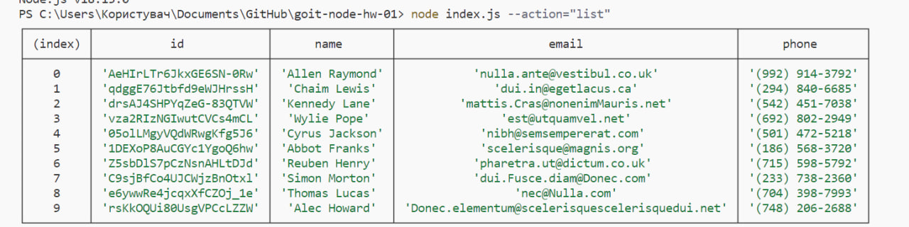
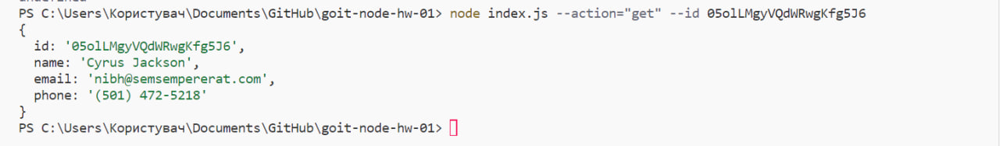
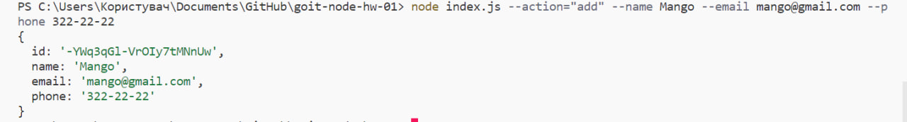
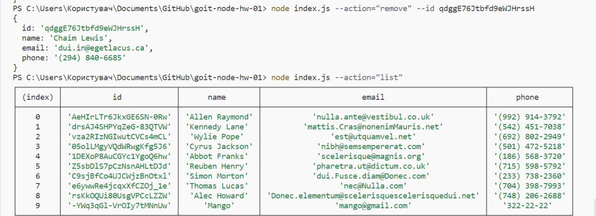

# goit-node-hw-01

Команда для отримання і виведення всього списку контактів у вигляді таблиці

```node
node index.js --action="list"
```



Команда для отримання контакта по id і виведення у консоль об'єкта контакту або null, якщо контакту з таким id не існує.

```
node index.js --action="get" --id 05olLMgyVQdWRwgKfg5J6
```



Команда для додавання контакта та виведення в консоль об'єкта новоствореного контакту

```
node index.js --action="add" --name Mango --email mango@gmail.com --phone 322-22-22
```



Команда для видалення контакта та виведення в консоль об'єкта видаленого контакту або null, якщо контакту з таким id не існує.

```
node index.js --action="remove" --id qdggE76Jtbfd9eWJHrssH
```


